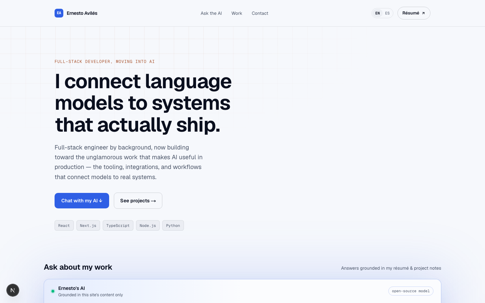
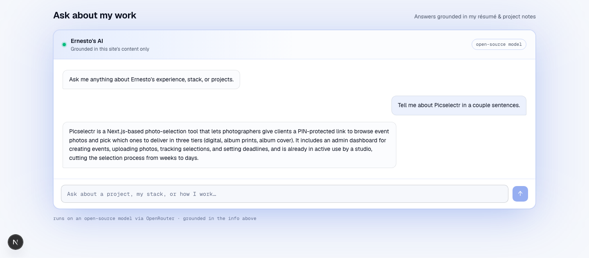
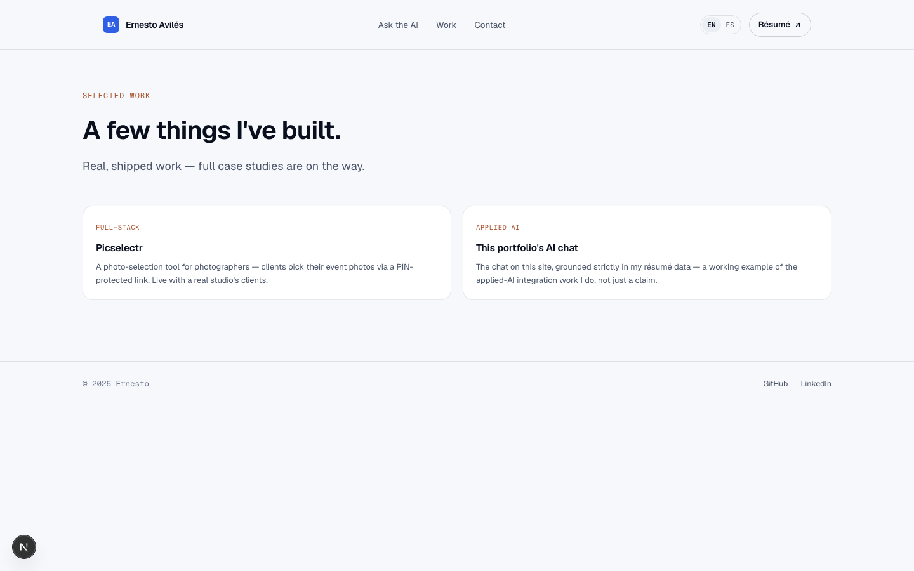

# Ernesto Avilés — Portfolio

**<a href="https://www.ernestoaviles.dev/" target="_blank" rel="noopener noreferrer">ernestoaviles.dev</a>** · [Resume PDF](public/Ernesto%20Aviles%20-%20Resume.pdf) · <a href="https://www.linkedin.com/in/ernesto-aviles-zavala/" target="_blank" rel="noopener noreferrer">LinkedIn</a>

A full-stack, bilingual portfolio site with a twist: instead of a static résumé, it embeds an AI chat that answers recruiter questions live, grounded strictly in my actual experience — a working demo of applied-AI integration, not just a bullet point on a resume.

|                     |  |
| ------------------------------------------------------------------------------------ | --------------------------------------------------------------------------------------------------------- |
|  |                                                                                                           |

## Why this repo is more than a template

Most portfolios are a static page. This one is a small full-stack app that demonstrates the skills it describes:

- **Grounded AI chat, not a chatbot wrapper.** [`src/app/api/chat/route.ts`](src/app/api/chat/route.ts) streams responses from an LLM via [Vercel AI SDK](https://sdk.vercel.ai/) over an OpenAI-compatible endpoint ([OpenRouter](https://openrouter.ai/)), with the system prompt built from [`content/profile.md`](content/profile.md) at request time. The model is instructed to answer only from that content and decline anything else — no hallucinated experience.
- **Real internationalization**, not a translated title tag. Every string is routed through [`next-intl`](https://next-intl.dev/) with locale-aware cookies and middleware, fully supporting English and Spanish ([`messages/en.json`](messages/en.json) / [`messages/es.json`](messages/es.json)).
- **Modern App Router architecture** using React Server Components, streaming, and Next.js 16 conventions rather than a bolted-on SPA.

## Tech stack

| Layer      | Choice                                                                                                                              |
| ---------- | ----------------------------------------------------------------------------------------------------------------------------------- |
| Framework  | [Next.js 16](https://nextjs.org/) (App Router, React 19)                                                                            |
| Language   | TypeScript                                                                                                                          |
| Styling    | Tailwind CSS v4                                                                                                                     |
| AI / LLM   | [Vercel AI SDK](https://sdk.vercel.ai/) (`ai`, `@ai-sdk/react`, `@ai-sdk/openai-compatible`) + [OpenRouter](https://openrouter.ai/) |
| i18n       | next-intl (English / Spanish)                                                                                                       |
| Validation | Zod                                                                                                                                 |
| Deployment | Vercel                                                                                                                              |

## Getting started

```bash
git clone https://github.com/Eavilesz/portfolio.git
cd portfolio
npm install
cp .env.example .env   # add your OPENROUTER_API_KEY (free at openrouter.ai/keys)
npm run dev
```

Open [http://localhost:3000](http://localhost:3000).

```bash
npm run lint    # ESLint
npm run build   # production build
```

## Project structure

```
src/
  app/
    api/chat/route.ts   # streaming chat endpoint, grounded in content/profile.md
    projects/page.tsx   # case-study listing
    page.tsx            # home: hero, AI chat, work teaser
  components/            # Hero, ChatSection, Nav, Footer, locale switcher
  i18n/                   # next-intl config, locale actions & middleware glue
content/
  profile.md              # single source of truth for the AI chat's knowledge
messages/
  en.json / es.json        # UI copy per locale
```

## Featured projects


- **Picselectr** — a photo-selection tool for photographers: clients get a PIN-protected link to choose event photos across tiered packages. Built with Next.js, Supabase (auth/DB/RLS), and Cloudflare R2. In active production use by a real photography studio.
- **This portfolio's AI chat** — see above.

## Contact

- Email: ernesto-av@hotmail.com
- GitHub: [github.com/Eavilesz](https://github.com/Eavilesz)
- LinkedIn: <a href="https://www.linkedin.com/in/ernesto-aviles-zavala/" target="_blank" rel="noopener noreferrer">linkedin.com/in/ernesto-aviles-zavala</a>
